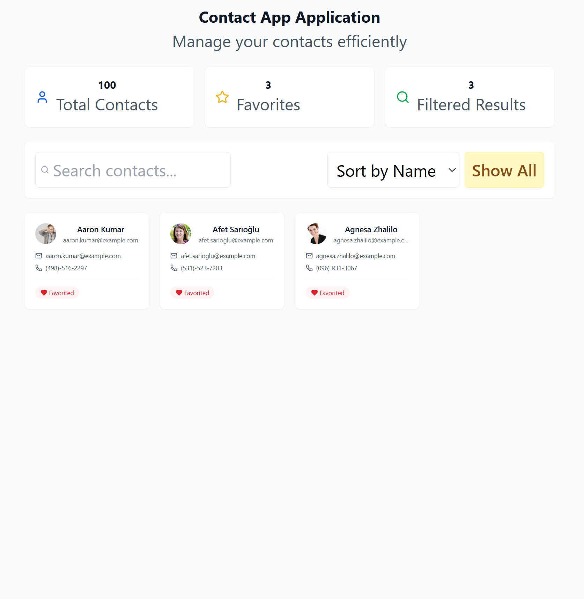
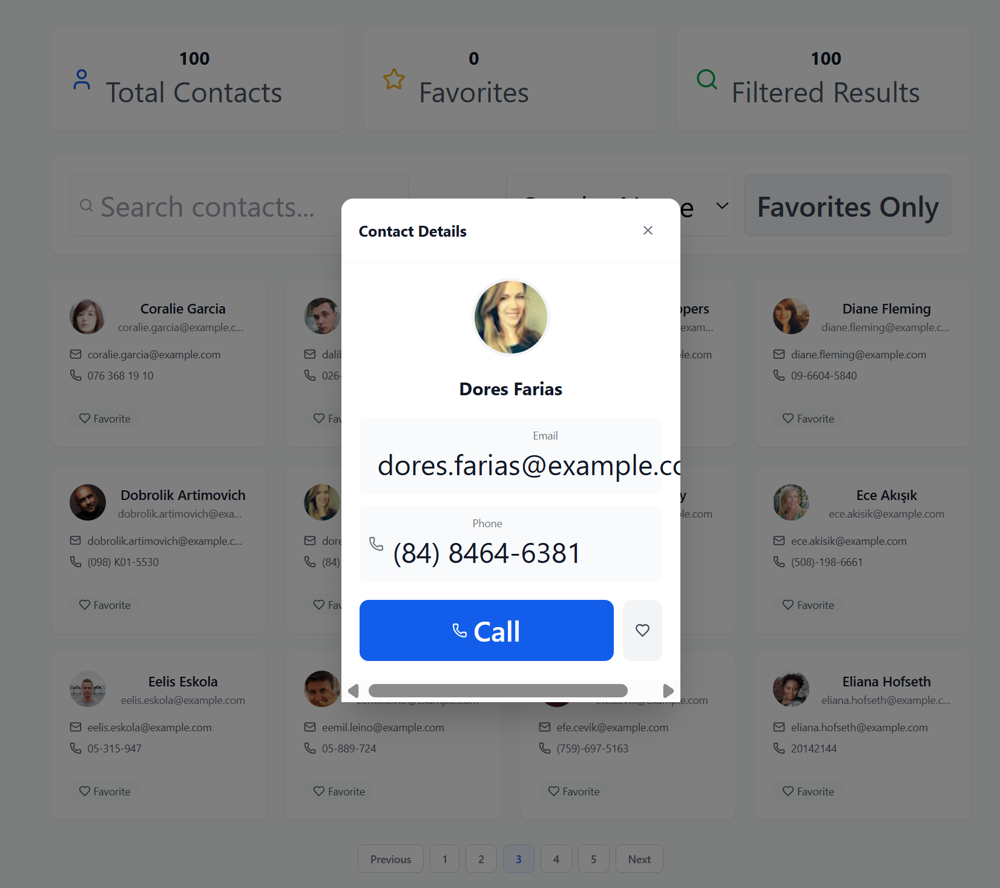
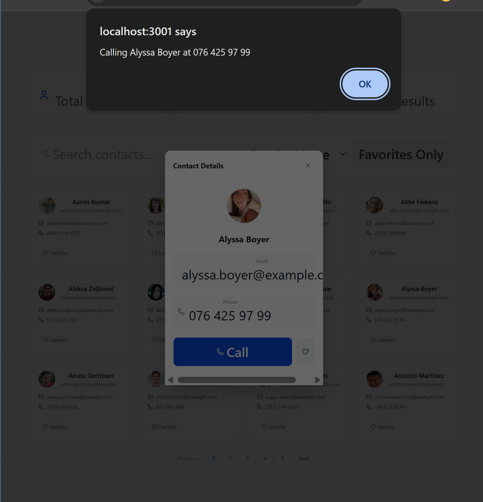
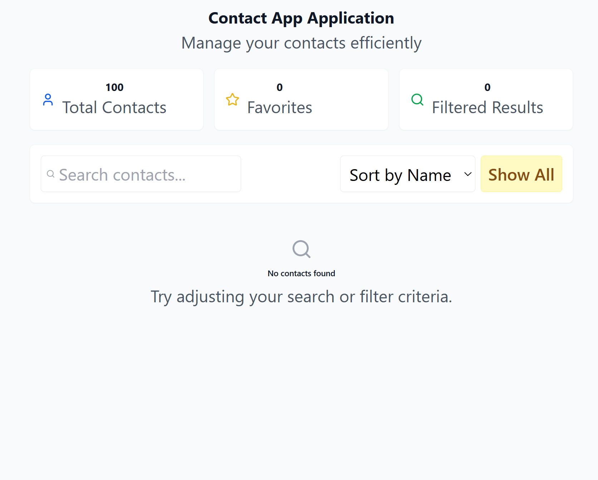
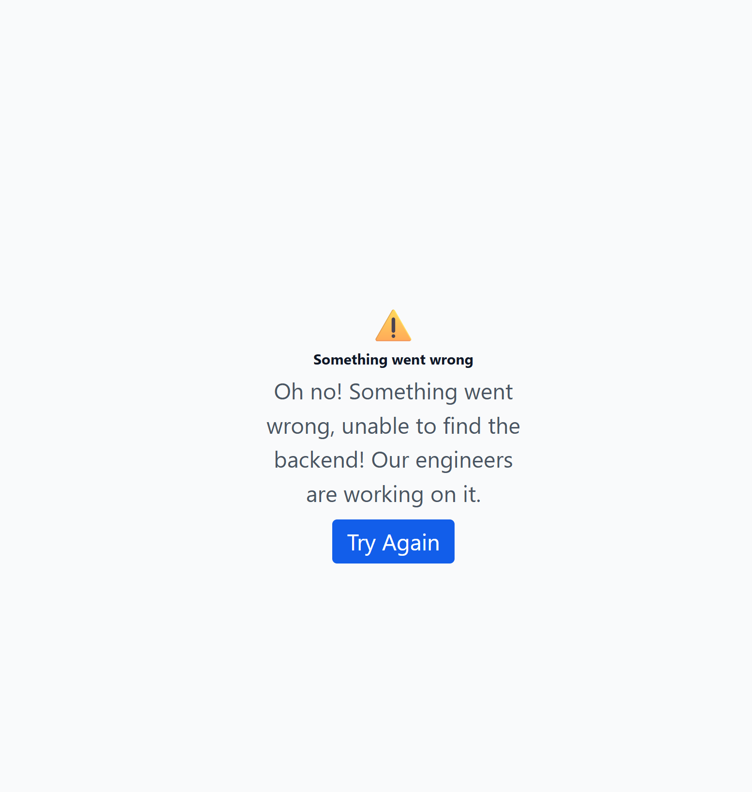

# Contact Application 
A responsive contact management interface built with react, typescript and tailwind CSS connected to the NestJS backend, with data from the randomuser api

## Project Overview
- view the paginated contacts (simple)
- search contacts by name
- sort by name, email, number
- mark favorite
- view contact + call

## Setup Instructions

Preq
- nodejs
- npm

### Setup frontend

```
- cd frontend 
- npm install 
- npm start
```
is set to run on port 3001

### Setup backend
```
- cd backend
- npm install
- npm start

```
is set to run on port 3000


### Overall Architecture


### Current UI

Default Screen


Fav only



Selecting a contact



Calling



When there are no search results



unable to connect to the backend


