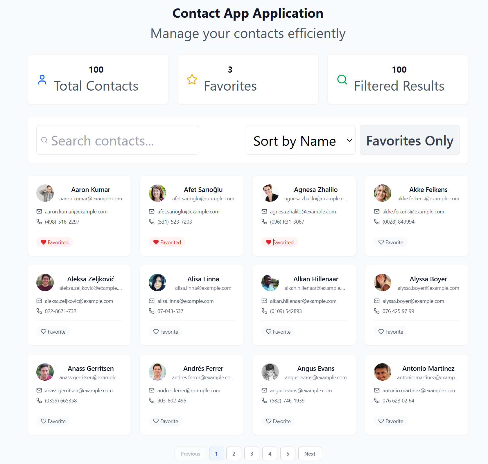

# Contact Application 
A responsive contact management interface built with react, typescript and tailwind CSS connected to the NestJS backend, with data from the randomuser api

## Project Overview
- view the paginated contacts (simple)
- search contacts by name
- sort by name, email, number
- mark favorite
- view contact + call

## Setup Instructions

Preq
- nodejs
- npm

### Setup frontend

```
- cd frontend 
- npm install 
- npm start
```
is set to run on port 3001

### Setup backend
```
- cd backend
- npm install
- npm start

```
is set to run on port 3000


### Overall Architecture


### Current UI

Default Screen




Fav only


Selecting a contact


Calling


When there are no search results


unable to connect to the backend


##  Future Improvement: Backend Pagination

###  Current Implementation

At the moment, pagination is done on the **frontend**. The backend sends all 100 contacts in one response, and the UI slices the data into "pages" for display.

While this works for small datasets, it has several limitations:

- All data is fetched regardless of how much the user actually views
- Not scalable as performance will degrade with 1000+ contacts
- Higher memory usage as the frontend holds the full dataset even when unnecessary
- Slower experience especially on low-end devices

---

### Planned Improvement: Backend Pagination

In future iterations, pagination logic will move to the backend, following standard RESTful API patterns.

eg: GET /contacts?page=2&limit=10
The backend slices only the relevant data (e.g., 10 contacts for page 2)
The client receives just that subset


to maintain performance and reduce unnecessary data transfer, and support more advanced features (e.g., filtering, sorting, search), we should move the logic to the backend before we pass it to the client. This way uses the RESTful query parameters which aligns with industry standards and makes your API more modular and extensible.

