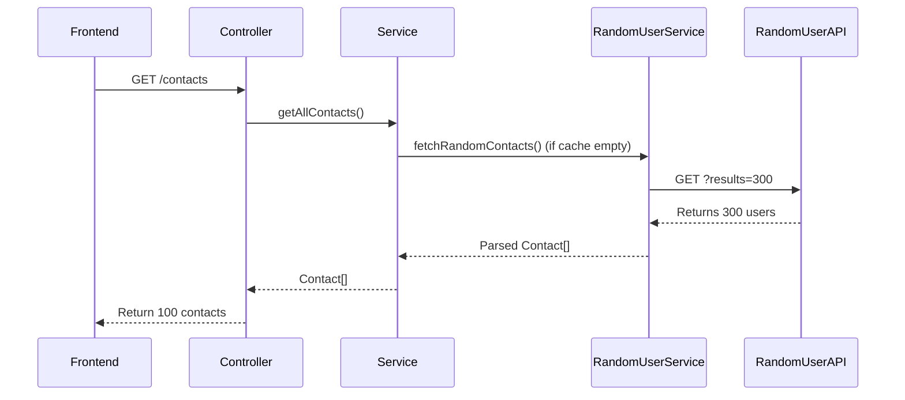

# Backend for the Contact Application

This outlines the **architectural** and **design decisions** made for the contact management backend.

Each decision was made intentionally after considering:

- Maintainability  
- Scalability  
- Performance  

I aimed to follow **NestJS best practices** and **Clean Architecture** principles.

---

##  Setup & Running Instructions

1. Clone the repo  
2. Navigate to the backend folder  
3. Run:

   ```bash
   npm install
   npm start
    ````

The server runs on **port 3000** (hardcoded).


## Problem Analysis

The Random User API returns different users on each call, making it hard to maintain a stable contact list or favorites.

###  Solution: Seed-Once Architecture

* Fetch **300 contacts** once on app startup
* Store them in **in-memory cache** (map)
* Serve only **100** contacts to the frontend

#### Reasoning:

* Ensures **data consistency** across requests
* Eliminates repeated external API calls = **better performance**
* Enables **reliable "favorite" functionality**
* Reduces dependency on external service availability

#### Trade-offs:

* the data is not persistent. Once you turn it off, it would go away

---

## Design Decisions

### Module Structure

* Single `contacts` module
* No separate `favorites` module

#### Why?

* **Domain cohesion**: Favorites are a property of a contact
* No business logic exists outside of a contact
* Keeping it within one **bounded context** simplifies reasoning (Domain-Driven Design)

#### Alternative Rejected:

* A separate `favorites` module was considered
* But it seemed to create **artificial separation** without added business value

---

## Two Main Domains

1. `api/`

   * Integrates with **Random User API**
   * Encapsulates external dependency logic

2. `contacts/`

   * Manages contact data
   * Handles all business logic: fetching, filtering, marking favorites

---

##  API Endpoints

| Method | Endpoint                 | Description                      |
| ------ | ------------------------ | -------------------------------- |
| GET    | `/contacts`              | Return up to 100 cached contacts |
| GET    | `/contacts/:id`          | Return contact by ID             |
| POST   | `/contacts/favorite/:id` | Toggle favorite status (via DTO) |
| GET    | `/contacts/favorites`    | Return all favorited contacts    |

---

## External API Integration

* One-time **fetch at startup**
* Isolated via a **dedicated service class**

This way, the **business logic is unaware** of external API structure — improving modularity and testability.

---

##  Storage Architecture

### Current:

* **In-memory storage** - key value store (non-persistent)

### Future:

* File-based or relational DB (e.g., PostgreSQL)

####  Design Rationale

* Leverages the **Dependency Inversion Principle**
  → Business logic depends on **abstracted interfaces**, not concrete storage
  → Allows easy switching of storage strategies later

---

##  DTOs

* Used for **data validation** using `class-validator`
* Ensures invalid data doesn’t reach the service layer
* Each DTO has a **clear purpose**

---

## Controller Layer

Acts as the **entry point** for all HTTP requests.

Responsibilities:

* Validate route params + query strings
* Call service layer methods
* Return clean HTTP responses

Implements the 4 core endpoints listed above.

---

##  Service Layer

Holds the **core business logic**.

Key responsibilities:

* Manage in-memory store
* Enforce correct data types
* Delegate fetch to `RandomUserService`
* Filter, sort, and transform data for the frontend

Key methods:

* `getAllContacts()`
* `getContactById(id)`
* `updateFavoriteStatus(id, isFavorite)`
* `getFavoriteContacts()`
* `getFilteredContacts(query)`

---

##  Random User API Service

Encapsulates logic to interact with [`https://randomuser.me/api/`](https://randomuser.me/api/)

* Fetches **300 users** on demand
* **Can be mocked** or replaced later if needed

---

## Error Handling

* Handles errors like invalid contact ID gracefully
* Restricts errors to **inside business logic** where possible
* Ensures client receives **clear feedback**

---

## Config Layout

* Standard **NestJS folder structure**
* Feature-based modularization:

  * `api/`
  * `contacts/`

---

##  Overall Architecture Summary

 - Modular Structure + Dependency Inversion + Domain Encapsulation (external API is isolated) + Clear Separation of Concerns


* Controller → Request entry
* Service → Business logic
* API Layer → External dependencies

---

## Future Development Considerations

* Migrate to **persistent DB**
* Support **lazy loading** or paginated fetch from Random User API

---

##  Sequence Diagram


<pre>

</pre>


