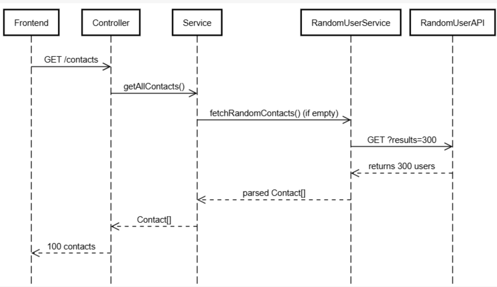

# Backend for the contact application

This would outline any architecutral and design decisions made for the contacts managment backend application. 

Each decision was made intentionally. I considered factors like 
* maintainability
* scalability
* performance

I attempted to adhere to the NestJs Best practices, and the clean architecture prinicples.

---

### Setup + running instructions
1. clone the repo
2. cd to the backend folder
```
npm install
npm start
```

the server runs on port 3000 (hardcoded)
### problem analysis
- managing the contact data from the random user API, where each of the API call returns the different users. This makes it impossible to maintain consistent data for fav

To solve this (attempt 1):
Seed-Once Architecture
- load contact data once at the application startup and maintain it in persistent storage

solution
- fetch 300 contacts once in a startup
- cache them in the in memory storage
- serve only 100 to the front end

reasoning:
- data is consistent. each contant can maintain a stable identity across the requests
- the performance is better, as it eliminates repeated external API calls
- the user experience is better, as it enables the reliable favourite functionality
- it is more reliable as it reduces the dependency on the external service availability

Possible trade offs:
- while you have predictable data, it might stop you from getting new data
- while you have a fast response,  it might stop you from having real time updats


### Design:

Module structure design
- have a single contacts module (no fav module)

reason:
- domain cohesion: we want to store the contacts, and possibly mark them as the fav
- fav are a property of the contacts, and they are not an independent entity
- not biz logic exists w/o their parent contact
- single bound context = single module (following the domain driven design principle)

Alternative considered 
- a separate fav module. tho rejected it, as it would increase the complexity of it, by creating artificial separation. this would seem to increase complexity without business reason


### Two main domains
1. api/
* it helps to integrate our backend with the data layer (random user api)
* helps to encapsulate the external logic

2. contacts/
* responsible for transforming and manging the contact data
* helps to handle all the biz logic overall (fetchin, filtering, and favs)


### API Design

* GET /contacts = return up to 100 cached contacts
* GET /contacts/:id = return one contact by ID
* POST /conatcts/favorite/:id = update fav status (via DTO)
* GET /contacts/favorites/:id = return the list of all fav contacts

### external api integration
- service abstraction with single initialisation 

design
- isolate the external dependency. so the external api call is contained in a dedicated service. the business logic is unaware of the exteranl api strucutre

### Storage Architecture

current: in memory store current

future:
- file based persistance
- relational DB

Design rationale
dep inversion principle
- biz logic now depends on storage abstraction (there is no concrete implementation)
- allows you to switch btw storage strategies 


### DTO 
- each DTO has it's purpose. There is input validation at the DTO level using the class validator.
- the biz rules are enforced before reaching the service layer


### Controllder Layer
Entry point for all HTTP requests

responsiblities
* validates the route params + query strings
* calls the appropriate service methods
* returns the clean HTTP responses

implements the 4 end points

### Service Layer
Has the core biz logic, it helps to cache and then it serves the data
- helps to filter, sort the data

Key methods
- getAllContacts()
- getContactById(id)
- updateFavoriteStatus(id, isFavorite)
- getFavoriteContacts()
- getFilteredContacts(query)

responsiblities
- manage the in memory store
- enfore the data type
- delegates the fetch to the random user service

### random user API service

- encapsulates the loic to interact with the https://randomuser.me/api/
- it would fetch the 300 users on demand (hardcoded)
- can be mocked or swapped for some other api later

### error handling
- caught errors when the id is wrong,
- tried to catch and restrict errors found in the app logic within the biz logic 

### config layout
- uses the standard nestjs project layout


### Overall architecutre
- modular structure (each feature has its own folder)
* the api and the contacts 
- dependency inversion (services dont depend on the storage implemnetation)

- domain encapsualtion (external API is isolated from the core logic)
- separation of concerns (controller, service + integration layer)


### Future Dev Considerations
- move from in memory to DB storage (persistance)
- fetch contacts page by page from random user API (lazy loading) 


### sequence diagram



